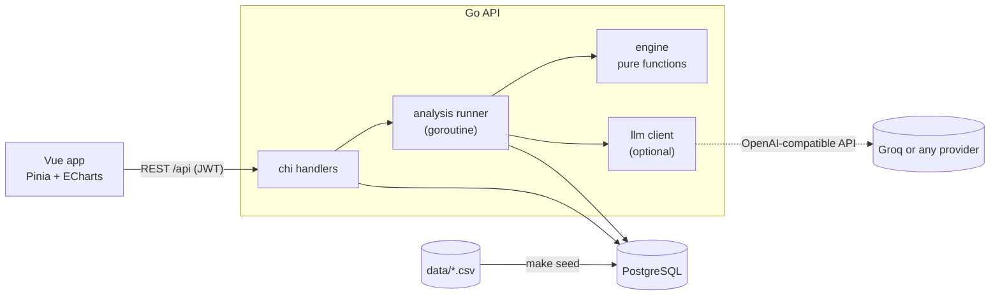

# Astrophage

AI energy management MVP. It turns the hourly readings of 12 electric meters (14 days) into operational decisions:
**data → analysis → anomaly → explanation → prioritization → action**. An operator can see in a minute which meter to
check first and *why* the AI reached that conclusion.

The UI is in Spanish and branded **Ohmline** (from the approved design). Code, comments and docs are in English.
The original brief is in [docs/new_project.pdf](docs/new_project.pdf); the design system and mockups are in [design/](design/).

## Quick start

Requirements: Go 1.24+ (the toolchain fetches the exact version in `go.mod`), Node 20+, and a local PostgreSQL
(the defaults assume user `postgres` / password `postgres` on `localhost:5432`).

```bash
cp .env.example .env     # optional: add LLM_API_KEY, or change DATABASE_URL
make db                  # creates the `astrophage` database
make seed                # migrations + 12 meters, 4.032 readings, 4 events + the demo user
make api                 # terminal 1: http://localhost:8080  (health: /api/health)
make web                 # terminal 2: http://localhost:5173
```

Open http://localhost:5173. The login comes prefilled: `demo@energy.io` / `demo123`.
`make seed` can be run again at any time: it wipes and reloads everything, which resets the demo to "no analysis yet".
`make test` runs every test (see [Tests](#tests)).

Without `LLM_API_KEY` the app works fully and writes the explanations from deterministic templates. With a key
(Groq by default, see [LLM explanations](#llm-explanations)) the AI writes them from the evidence.

## Demo script (5–10 min)

1. **Login → dashboard.** No analysis yet: KPIs show "—", the priority list invites you to run it, meters read "Sin evaluar".
2. **Run AI Analysis.** The stepper walks the 7 stages (Lecturas → Baseline → Detección → Correlación → Eventos →
   Explicación → Recomendación) and ends with *"4 anomalías detectadas, 2 requieren atención prioritaria"*.
3. **Medidores**, sort by *Variación*: **M-109** is on top (+110,7%).
4. **M-109 detail.** Consumption doubles on 12 Sep at 14:00, far outside the baseline band; the power factor falls; no event.
5. **Investigation.** The explanation with concrete numbers, the variables that changed, why the confidence is 0,94,
   the recommended action ("Investigar medidor e instalación") and the evidence. Mark it *en investigación* or resolve it.
6. **Contrast.** M-112 (stable consumption, erratic electrical readings → validate the meter), M-104 (explained by the
   new production line), M-106 (12 h drop explained by a scheduled outage → do not escalate).
7. **Close.** Why the AI concluded each case, and what the operator should do first.

## Architecture



```
backend/    Go API: cmd/api, cmd/seed, internal/{config,db,http,analysis,engine,llm,seed}, migrations, openapi.yaml
frontend/   Vue 3 app (views, components, stores, utils, services)
data/       readings.csv, events.csv
design/     design system (tokens.json, DESIGN.md) and mockups
docs/       the original brief
```

The core idea: the **engine is a package of pure functions** (`Run(readings, events, cfg) → []AnomalyResult`). It decides
type, severity, priority and confidence and gathers the evidence. Everything else only orchestrates, stores and shows it.
The LLM never decides anything: it rewrites the text from the evidence, and its output is validated.

Stack: Go, chi, pgx (hand-written SQL, no ORM), golang-migrate, PostgreSQL · Vue 3, Vite, TypeScript, Pinia, Vue Router,
Tailwind v4 (theme generated from the design tokens), ECharts · Vitest and `go test`.

## Analysis engine

`backend/internal/engine` is a package of pure functions: `Run(readings, events, cfg) → []AnomalyResult`.
It has no HTTP or database dependencies, is deterministic and is tested against the real dataset
(`go test ./internal/engine/...`). All thresholds live in `backend/internal/config/engine.go`.

Pipeline: readings → baseline → detection → correlation → events → explanation → recommendation.

| Step | What it does | Why |
|---|---|---|
| Baseline | Median and scaled MAD of consumption, voltage, current and PF **per hour of day**, from the first 7 days | The load has a strong daily pattern, so a single average would flag every morning. Median/MAD are robust to outliers |
| Consumption detection | Robust z-score per reading; a **persistent change** is ≥ 6 consecutive hours with \|z\| > 4 in the same direction | Isolated 1–2 h spikes are normal noise and never become anomalies |
| Data quality | Flags voltage outside ±5% of 220 V, voltage jumps > 10 V, PF jumps > 0.2, kWh not matching V·I·PF (±30%). Recurrent = ≥ 5 flagged hours within 24 h, **and** no persistent consumption change | Quality problems are found in the readings. The `status` column is always `OK`, and the event type is never used as a label |
| Correlation | For each window: Δ current, Δ PF, Δ mean voltage, Δ voltage spread vs baseline | A rise in consumption with a PF drop points to a load or installation problem |
| Events | An event within 6 h before / 2 h after the window start explains it only if it is **compatible**: an outage must match the described duration and consumption must return to baseline; an operational change must be an upward step without electrical deterioration. `UNKNOWN` never explains. `DATA_QUALITY` only corroborates | Time coincidence alone is not an explanation |
| Classification | Persistent change + compatible outage → `FALSE_POSITIVE`/LOW · + compatible operational change → `EXPLAINABLE_ANOMALY`/MEDIUM · unexplained → `REAL_ANOMALY`/HIGH · recurrent quality flags with stable consumption → `DATA_QUALITY`/HIGH | Matches the cases in the brief |
| Priority (0–100) | Magnitude 25 + persistence 15 + electrical deterioration 20 + no explanation 20 + extra kWh 20; `FALSE_POSITIVE` capped below 20 | Ranks what to investigate first. The breakdown is stored in `evidence.priority_breakdown` |
| Confidence (0–0.99) | 0.40 base + signal strength 0.25 + independent signals 0.20 + explanation clarity 0.10 | Breakdown in `evidence.confidence_breakdown` |

Result on the dataset: M-109 `REAL_ANOMALY` (priority 100) > M-112 `DATA_QUALITY` (71.8) > M-104 `EXPLAINABLE_ANOMALY` (46.6)
> M-106 `FALSE_POSITIVE` (19). The other 8 meters produce no anomaly. The explanation texts come from
deterministic templates in Spanish (`explain.go`); an LLM can rewrite them later but never changes the classification.

Limitations: thresholds are tuned to this dataset; the 7-day baseline is short and assumes it contains no
anomalies (true here); one anomaly is reported per meter (the highest-priority window).

## LLM explanations

The engine decides type, severity, priority and confidence; the LLM only **writes** `reason`, `explanation` and
`recommended_action` from the evidence, during the "Explicación" stage. It never changes the classification.

- Any OpenAI-compatible API works; configure `LLM_BASE_URL`, `LLM_API_KEY`, `LLM_MODEL` in `.env` (defaults: Groq,
  `openai/gpt-oss-20b`, `LLM_REASONING_EFFORT=low`, which is only for reasoning models — leave it empty otherwise).
- Without `LLM_API_KEY` the app makes no external calls and uses the deterministic templates in
  `engine/explain.go`. `explanation_source` (`LLM` or `TEMPLATE`) is stored per anomaly and shown in the UI.
- The answer is validated before it is used: valid JSON with the three fields, `reason` one sentence,
  `explanation` at most 4, and **every number it cites must come from the evidence** (allowing rounding), so the
  model cannot invent figures. If a call fails, times out (8 s), is rate limited, or the answer is rejected, that
  anomaly keeps its template text (after one retry). The analysis always completes.
- The prompt is small (~1k tokens) because free tiers limit tokens per minute (Groq: 8.000 for this model). One
  analysis fits; running several in the same minute makes some anomalies fall back to templates.
- Calls run in parallel, one per anomaly (typically about 1–2 s in total).

## API

REST under `/api`, documented in [backend/openapi.yaml](backend/openapi.yaml). JWT auth (`POST /api/auth/login`) on
everything except `/health`. Main flow: `POST /ai/analyze` starts a run in a goroutine (409 if one is already
running), `GET /ai/analysis/{id}` reports the stage and per-stage state, and `GET /anomalies` returns the
anomalies of the latest completed run ordered by priority. `GET /meters` supports `status`, `search`, `sort`
(`consumption`, `variation`, `severity`) and `order`; `GET /meters/{id}/readings` returns the series with the
baseline band for each point (`granularity=hour|day`).

The engine runs as one pure computation during the "Detección" stage; the seven stages of the stepper mirror the
pipeline and pause `ANALYSIS_STEP_DELAY_MS` (default 600) each so the progress is visible. Runs left in progress
by a previous process are marked `FAILED` on startup.

Meter status is derived from the latest analysis: `REAL_ANOMALY` → CRITICAL, `DATA_QUALITY` and
`EXPLAINABLE_ANOMALY` → ALERT, `FALSE_POSITIVE` and no anomaly → OK.

## Frontend

Vue 3 + Vite + TypeScript, Pinia, Vue Router, Tailwind v4 and ECharts. The UI follows the approved mockups in
`design/` (the product is branded **Ohmline** there). `npm run tokens` regenerates `src/assets/theme.css` from
`design/tokens.json` (color aliases such as `{ink-muted}` are resolved), so classes like `bg-surface`,
`text-ink-muted` or `rounded-lg` come straight from the design tokens.

Screens: login (demo credentials prefilled), the dashboard (analysis card with the 7-stage stepper, KPI
strip, daily consumption chart with baseline, "Qué atender primero", meter status tiles) and the meters table
(status filters with counters, `meter_id` search, sort by consumption / variation / status, 14-day sparklines).
Filters, search and sorting are sent to the API (`GET /meters?status=&search=&sort=&order=`); the counters come from
an unfiltered request.

The rest of the flow: **meter detail** (`/meters/:id`: the AI verdict, KPIs, hourly consumption against the baseline
band with the anomalous window shaded, voltage / current / power factor and the meter's events), the **anomalies**
table (`/anomalies`: priority bar, type, severity, confidence, reason and an action button named after the type) and
the **investigation** (`/anomalies/:id`): what the AI found, daily comparison against the baseline, the variables that
changed (or the failed quality checks for a data-quality anomaly), classification with a breakdown of *why* that
confidence, the recommended action with *Marcar en investigación* / *Resolver* / *Reabrir* (a `PATCH` on the anomaly),
the related events and the evidence rules that fired. The confidence breakdown is drawn from the weights the engine
publishes in `evidence`, so the UI does not repeat the engine's numbers.

How it behaves: **Run AI Analysis** starts the run and polls it every 500 ms; the stepper follows the real stage of
the run, and reloading the page mid-run resumes following it. An expired or invalid token (401) clears the session and
returns to the login. Logic that can go wrong silently (formatting, stepper and KPI builders, polling and
cancellation, stale responses, route guard, login errors) is covered by Vitest (`cd frontend && npm test`).


### Data and demo user

The seed validates the CSVs (duplicates, gaps in the hourly grid, negative or empty values) and prints any issues; this
dataset has none. It also assigns the demo names and locations of the design (for example M-109 "Tablero principal B",
Planta Sur). Migrations live in `backend/migrations` (embedded in the binary and applied by the seed command). If
`design/tokens.json` changes, regenerate the Tailwind theme with `cd frontend && npm run tokens`.

## Design decisions and limitations

Decisions

- **Simple on purpose.** No ORM, no repository/service layers, no message queue: handlers call `db` and `analysis`
  directly. The analysis runs in a goroutine, one at a time (a second request gets `409` with the running id).
- **Explainable by construction.** Every anomaly stores its evidence, the rules that fired and the breakdown of its
  priority and confidence. The UI draws those breakdowns from weights published by the engine, so numbers are not duplicated.
- **No label leakage.** The event type is never used to classify: M-112 is found as a data-quality problem from its
  readings, and stays one even if its event is relabeled or removed (there is a test for it). An event only *explains* a
  change if it is compatible with it, not just close in time.
- **The LLM can fail without consequences.** If it is missing, slow, rate limited or wrong, the template text is used.
- **`expected_results.csv` is not part of this repo and is never used.** The expected cases come from the brief.

Limitations (this is an MVP, not production)

- Thresholds are tuned to this dataset and live in `backend/internal/config/engine.go`. The 7-day baseline is short and
  assumes it contains no anomalies (true here); a real system would use more history and weekly seasonality.
- One anomaly per meter (its highest-priority window). Hours are UTC. Data is loaded by the seed: no live ingestion,
  no meter CRUD, one demo user, no roles, no rate limiting on login. Change `JWT_SECRET` before showing this to anyone.
- Running a new analysis replaces the visible anomalies with the new run's (their ids change, acknowledged/resolved states reset).
- The stepper shows the real stage of the run, but the engine itself is a single fast computation; each stage pauses
  `ANALYSIS_STEP_DELAY_MS` (default 600) so progress is visible.
- Free LLM tiers limit tokens per minute: one analysis per minute fits comfortably; more may fall back to templates.
- No Docker Compose: the app uses your local PostgreSQL. The UI targets desktop: no horizontal overflow down to about 1024 px, and the meters table scrolls inside its card below that.
  No ESLint: the strict `vue-tsc` type-check and Prettier are used.

## Tests

`make test` runs both suites: `go test ./...` (engine on the real dataset, API cycle, LLM client against a fake server,
config, seed) and `npm test` (Vitest: formatting, stepper and KPI builders, polling and cancellation, stale responses,
route guard, login, the tables and the action buttons). The API tests need PostgreSQL: they create and use their own
`astrophage_test` database (override with `TEST_DATABASE_URL`) and skip themselves if it is not reachable.
